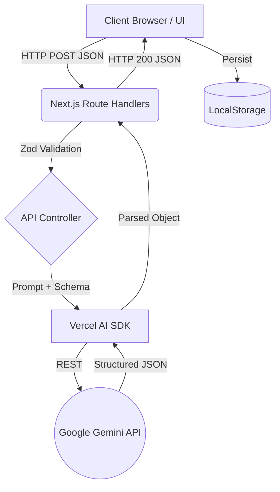

# Complete Technical Knowledge Base: SkillForge

---

## 1. Project Overview

**Project Name:** SkillForge
**Problem Statement:** Developers and job seekers often struggle to identify exactly what skills they are missing for their target roles, lack a clear structured path to acquire those skills, and have no way to objectively assess their interview readiness. Generic roadmaps are not tailored to an individual's current experience, leading to wasted time.
**Why this project was built:** To bridge the gap between a user's current skill set and industry demands by leveraging AI to generate highly personalized, actionable learning roadmaps and providing interactive tools like mock interviews to ensure job readiness.
**Target Users:** Software Engineers, Data Scientists, Product Managers, and IT professionals looking to upskill, switch careers, or prepare for job interviews.
**Objectives:**
- Provide an objective skill gap analysis.
- Generate dynamic, weekly learning roadmaps.
- Offer AI-driven mock interviews.
- Deliver a premium, highly interactive user experience without requiring immediate backend database lock-in.
**Core Features:**
- AI-Powered Skill Gap Analysis
- Personalized Weekly Roadmap Generation
- AI Mentor (Nova) for conversational guidance
- Automated Project & Resource Recommendations
- Interactive Mock Interviews with AI feedback
- ATS Resume parsing and optimization
- Completely local-first architecture (localStorage) for immediate onboarding

---

## 2. Complete Tech Stack

**Programming Language:** TypeScript (Provides static typing, reducing runtime errors and improving developer experience).
**Frontend Framework:** Next.js 16.2.7 App Router (Chosen for its robust file-based routing, server components, and performance optimizations).
**Backend Framework:** Next.js Route Handlers (Provides seamless API integration within the same monolithic repository without needing a separate backend server).
**Database:** LocalStorage (Client-side) & Prisma Client configured for SQLite (`dev.db`). (Chosen for zero-friction onboarding. Users can try the app immediately without creating an account. The SQLite DB is prepped for future server-side persistence).
**Authentication:** Not implemented initially by design to reduce friction, but architectural space is reserved for NextAuth/Auth.js.
**AI Models:** Vercel AI SDK (`@ai-sdk/google`, `ai`).
**LLM Provider:** Google Generative AI (Gemini).
**Model Name:** `gemini-2.5-flash-lite` (Chosen for extremely fast inference times, which is critical for real-time roadmap generation and chat streaming, while maintaining high reasoning capabilities at a lower cost).
**API Keys Used:** `GOOGLE_GENERATIVE_AI_API_KEY`
**Libraries:**
- `framer-motion`: For complex, physics-based UI animations, page transitions, and micro-interactions.
- `lucide-react`: For clean, customizable SVG icons.
- `zod`: For strict schema validation of API requests and AI structured outputs.
- `tailwind-merge` & `clsx`: For dynamic Tailwind class construction.
- `next-themes`: For dark/light mode toggling.
**Development Tools:**
- **IDE:** Cursor / VS Code
- **Package Manager:** npm
- **CSS Framework:** Tailwind CSS v4
**Environment Variables:** `.env` containing AI provider keys.

---

## 3. Overall Architecture

The application follows a Serverless Monolithic Architecture using Next.js. 

**Flow:**
Client (Browser) → Next.js React Frontend → Next.js API Routes (Backend) → Vercel AI SDK → Google Gemini API → JSON Response → Frontend State (LocalStorage).

**Architecture Diagram:**


**Communication:**
The frontend uses standard `fetch` calls to communicate with the Next.js API routes under `/api`. The API routes run securely on the server (Node.js runtime), hiding the Google API keys from the client. The AI SDK is used to enforce strict structured JSON outputs from the LLM, which are passed back to the client and saved in the browser's `localStorage` to persist state across sessions without requiring a heavy backend database.

---

## 4. Frontend Explanation

**How the frontend was built:**
The frontend leverages Next.js App Router and React Server/Client Components. Most interactive pages use `"use client"` to allow `framer-motion` animations and `localStorage` access.

**Component Structure:**
- **Pages:** Maps directly to routes (e.g., `/dashboard/page.tsx`, `/onboarding/page.tsx`).
- **Layouts:** `/dashboard/layout.tsx` manages the persistent sidebar, mobile navigation, and ambient animated backgrounds.

**State Management:**
State is managed locally within components using React `useState` and `useEffect`. Persistent state is aggressively synced to `localStorage` (e.g., `skillforge_profile`, `skillforge_roadmap`). This acts as a pseudo-database.

**Styling & Animations:**
Tailwind CSS v4 is used for all styling. The app uses a "Shonen Anime / Cyberpunk" aesthetic, relying heavily on custom CSS classes (`.comic-panel`, `.manga-font`, `.comic-skew`) combined with Tailwind utilities for thick borders, hard shadows, and skewed geometric shapes. `framer-motion` handles page mounting (`<AnimatePresence>`), layout changes, and complex hover effects (e.g., springy pop-outs).

**Forms & Validation:**
Forms use standard controlled React components. Submission triggers loading states (e.g., a "Processing" overlay in the onboarding flow) while `fetch` calls are made to the backend.

**Data Flow:**
1. User inputs data (e.g., Target Role).
2. Data is sent to `/api/analyze-skills`.
3. Response updates React state.
4. `useEffect` saves the new state to `localStorage`.
5. Other components (like the Dashboard Overview) read from `localStorage` on mount to display metrics.

---

## 5. Backend Explanation

**Backend Architecture:**
The backend consists exclusively of Next.js Route Handlers (`src/app/api/.../route.ts`). It is a serverless architecture where each endpoint handles a specific AI task.

**Folder Structure:**
`/src/app/api/` contains subfolders for each endpoint (`analyze-skills`, `generate-roadmap`, `chat`, etc.). Each folder contains a `route.ts` file exporting standard HTTP methods (POST).

**Request/Response Lifecycle:**
1. **Request:** Receives a POST request with a JSON body.
2. **Parsing:** Extracts variables (e.g., `targetRole`, `currentSkills`).
3. **Security:** Checks for `x-api-key` in headers or uses the server's `.env` API key.
4. **Business Logic / AI:** Calls `generateObject` or `streamText` from `@ai-sdk/google`. Passes a strict `zod` schema to force the LLM to return exactly the expected JSON format.
5. **Response:** Returns the parsed object as `NextResponse.json()`.
6. **Error Handling:** Try/catch blocks wrap the logic. Errors are logged and a 500 status code is returned with a safe error message.

**Why this architecture was chosen:**
Using Next.js Route handlers removes the need for a separate Node.js/Express server, drastically reducing deployment complexity, avoiding CORS issues entirely, and allowing types (if shared) to easily pass between frontend and backend.

---

## 6. Frontend ↔ Backend Connection

**Communication Method:**
Standard asynchronous HTTP `POST` requests via the `fetch` API.

**API Endpoints:**
- `/api/analyze-skills`: Analyzes current skills vs target role.
- `/api/generate-roadmap`: Creates the weekly syllabus.
- `/api/interview`: Handles conversational AI mock interviews.

**Request Flow Example:**
```javascript
const response = await fetch("/api/analyze-skills", {
  method: "POST",
  headers: { "Content-Type": "application/json" },
  body: JSON.stringify({ targetRole: "Backend Dev", currentSkills: ["Node"] })
});
const data = await response.json();
```

**CORS & Headers:**
Since the frontend and backend are hosted on the same origin (Next.js monolith), CORS is intrinsically bypassed. Custom headers like `x-api-key` are supported to allow users to bring their own API keys (BYOK).

**Data Transfer:**
Data is transferred strictly as `application/json`. The backend relies heavily on `zod` to define the output shape, ensuring that the JSON returned to the frontend is perfectly typed and immediately usable in the UI without complex parsing logic.
## 7. AI Implementation

**LLM Used:** Google Gemini 2.5 Flash Lite
**API Provider:** Google (via Vercel AI SDK `@ai-sdk/google`)
**Why this model:** Flash Lite is incredibly fast and cost-effective, making it perfect for instantaneous, repetitive generations like roadmap building and rapid chat responses in mock interviews, without sacrificing complex reasoning.
**Parameters:**
- **Temperature / Max Tokens:** The SDK defaults are used for most endpoints to balance creativity and determinism.
- **Structured Outputs:** Instead of generating raw text, the backend exclusively uses the `generateObject` function. This forces the LLM to map its reasoning directly into a rigid TypeScript schema (using Zod). 
**Context Management:** For the mock interviews, conversation history is managed on the frontend and sent as a structured array of `{ role: "user" | "assistant", content: string }` to the backend. The backend passes this directly into the LLM context to maintain conversational memory.
**Prompt Engineering:**
System prompts are heavily engineered to restrict the LLM to its persona (e.g., "You are an expert AI Career Coach"). Prompts inject user variables dynamically via template literals.
**Cost Optimization:**
By relying on `gemini-2.5-flash-lite`, the cost per token is negligible. Additionally, saving results to `localStorage` prevents the app from re-querying the AI for the same data on page reloads, acting as an aggressive caching mechanism.

---

## 8. API Keys

**API Keys Used:** `GOOGLE_GENERATIVE_AI_API_KEY`
**Purpose:** Authenticates requests to the Google Gemini model.
**Storage:** Stored in the `.env` file at the root of the project.
**Access:**
- The frontend **never** sees or accesses this key.
- It is accessed exclusively in the Node.js backend environment via `process.env.GOOGLE_GENERATIVE_AI_API_KEY`.
**Security Practices:**
- `.env` is added to `.gitignore`.
- API endpoints support a BYOK (Bring Your Own Key) model. If a user provides an `x-api-key` in the request headers, the backend will prioritize it over the environment variable. This allows the application to be hosted publicly without exhausting the developer's quota.

---

## 9. Database

**Database System:** LocalStorage (Client-Side Document Store)
**Why this database:** The project prioritized immediate user value and zero-friction onboarding. Setting up Postgres/MongoDB requires authentication, which creates a barrier to entry. LocalStorage allows instant, anonymous usage while still providing data persistence across sessions. 
*(Note: A Prisma `dev.db` SQLite file exists in the repo as the foundational architecture for future server-side persistence, but is not actively queried in the current MVP flow).*
**Schema (Virtual Collections in LocalStorage):**
- `skillforge_profile`: `{ targetRole, experience, currentSkills }`
- `skillforge_analysis`: `{ matchScore, readinessScore, missingSkills, matchedSkills }`
- `skillforge_roadmap`: `{ weeks: [{ title, objective, topics, resources }] }`
- `skillforge_topic_progress`: `Record<string, boolean>` (e.g., `"0-1": true`)
**Operations:**
The frontend acts as the ORM. Standard JSON serialization `JSON.stringify()` is used for Writes, and `JSON.parse()` for Reads.

---

## 10. Authentication

**Status:** Not implemented (Anonymous Mode).
**Why:** To ensure the fastest possible path to value for the user.
**Future Architecture:** The application is structured so that adding NextAuth/Auth.js would be trivial. Protected routes could be implemented in a Next.js `middleware.ts` file, and `localStorage` syncing could be replaced by a `fetch` call to a database `/api/user` endpoint upon successful JWT validation.

---

## 11. Folder Structure

```
skillforge/
├── src/
│   ├── app/
│   │   ├── api/             # Backend: Next.js Route Handlers
│   │   │   ├── analyze-skills/
│   │   │   ├── generate-roadmap/
│   │   │   └── ...
│   │   ├── dashboard/       # Frontend: Authenticated/Main User Area
│   │   │   ├── page.tsx     # Overview Dashboard
│   │   │   ├── layout.tsx   # Sidebar & Ambient Backgrounds
│   │   │   └── ...
│   │   ├── onboarding/      # Frontend: Initial Setup Flow
│   │   ├── globals.css      # Tailwind & Custom Manga/Anime Styles
│   │   └── layout.tsx       # Root React Layout
│   └── components/          # Reusable UI components
├── public/                  # Static assets (fonts, images)
├── prisma/                  # Future database schema
├── .env                     # Secrets
├── package.json             # Dependencies
└── next.config.ts           # Next.js settings
```
**Explanation:**
- **`app/api/`**: The entire backend. Separated logically by feature.
- **`app/dashboard/`**: Contains the core user experience. The `layout.tsx` wraps all subpages to provide persistent navigation.
- **`app/onboarding/`**: A standalone flow without the sidebar, designed to aggressively capture user data to generate the initial AI models.
- **`globals.css`**: The central stylesheet housing Tailwind configurations and custom utility classes that define the Shonen Anime aesthetic.

---

## 12. Complete Request Flow

**Scenario: User generates a Roadmap**

1. **User Action:** The user clicks "Generate Roadmap" on the frontend.
2. **Frontend Request:** The React component reads the profile from `localStorage` and sends a `POST` request to `/api/generate-roadmap` with the target role and missing skills as JSON.
3. **Backend Validation:** The Route Handler receives the request, parses the JSON, and checks for a valid API key.
4. **AI SDK Invocation:** The backend calls `generateObject()` from the Vercel AI SDK.
5. **Prompt Engineering:** The SDK merges the user's data into the system prompt and defines a strict `zod` schema requiring an array of weekly modules.
6. **LLM Execution:** Google Gemini processes the prompt and streams back a structured JSON response.
7. **Backend Processing:** The SDK validates the JSON against the `zod` schema to ensure type safety.
8. **Frontend Reception:** The backend returns an HTTP 200 with the JSON object.
9. **State Update:** The frontend parses the response, updates the React state (triggering a UI re-render), and saves the object to `localStorage`.
10. **User Output:** The user sees a newly generated, multi-week interactive skill tree on their dashboard.
## 13. Feature-by-Feature Technical Breakdown

**Feature: Skill Gap Analysis**
- **How it works:** Compares user skills to a target role.
- **Frontend:** Collects inputs via the `/onboarding` flow, manages a loading spinner, and renders the result as a percentage match.
- **Backend (`/api/analyze-skills`):** Uses Zod to define a schema (`matchScore`, `readinessScore`, `missingSkills`). Calls Gemini to perform the analysis.
- **AI Operations:** The prompt acts as an expert career coach, identifying industry standard requirements for the requested role and matching them against the provided array of strings.

**Feature: Roadmap Generation**
- **How it works:** Generates a custom weekly syllabus to learn missing skills.
- **Frontend:** Renders a nested "Skills Mastery Tree" on the dashboard overview, with checkboxes mapped to `localStorage` keys (`0-1`, `1-2` representing week and topic indices).
- **Backend (`/api/generate-roadmap`):** Returns a nested JSON object representing weeks, titles, objectives, and topics.
- **Algorithms:** A simple mapping algorithm on the frontend parses the nested arrays to render a tree view and calculate an overall progress percentage based on completed checkboxes.

**Feature: Dynamic Theme System**
- **How it works:** The UI uses a Manga/Cyberpunk theme.
- **Frontend:** Custom CSS in `globals.css` defines utility classes like `.comic-panel`, `.comic-skew`, and `.comic-shadow-primary`. Tailwind merges these seamlessly. The layout component wraps the main content in a grid pattern (`comic-bg-dots`). Framer Motion orchestrates hover effects (`whileHover={{ scale: 1.02 }}`) to give elements a physical, snappy feel.

---

## 14. Important Algorithms

**Roadmap Progress Calculation Algorithm:**
The frontend calculates overall progress by tracking individual checkboxes in a flat key-value map (`CompletedTopics`), while the original roadmap is a deeply nested array.
```javascript
let totalTopics = 0;
let completedCount = 0;
roadmap.weeks.forEach((week, wIndex) => {
  week.topics.forEach((topic, tIndex) => {
    totalTopics++;
    if (completedTopics[`${wIndex}-${tIndex}`]) completedCount++;
  });
});
const progressPercent = Math.round((completedCount / totalTopics) * 100);
```
*Why this was chosen:* Flattening the state into a map `Record<string, boolean>` makes it incredibly easy to serialize to `localStorage` and provides O(1) lookup times when rendering the UI, rather than mutating the original complex JSON roadmap object.

**Dynamic Score Interpolation:**
The app dynamically adjusts the user's initial "Match Score" as they check off topics on their roadmap.
```javascript
const currentScore = Math.min(100, Math.round(originalScore + ((100 - originalScore) * (progressPercent / 100))));
```
*Why this was chosen:* To provide immediate psychological reward. As the user completes tasks, their score visually increases in real-time towards 100%.

---

## 15. Prompt Engineering

**Skill Gap Analysis System Prompt Template:**
```text
You are an expert AI Career Coach.
Analyze the following user profile against their target role.

Target Role: ${targetRole}
Current Skills: ${currentSkills.join(", ")}
Experience: ${experience}

Compare their skills against what the industry currently demands for this role.
Identify their matched skills and the missing skills they need to learn.
Provide a Match Score (how closely their skills align) and an Industry Readiness Score (overall readiness out of 100).
```
**Why this prompt was designed this way:**
It uses explicit role assignment ("expert AI Career Coach") to set the tone and parameters of the LLM's knowledge retrieval. It forces structured context injection via template literals, ensuring the LLM doesn't hallucinate outside the bounds of the user's actual profile.

---

## 16. Deployment

**Hosting:** Vercel (Ideal for Next.js applications).
**Domain:** Custom domain via Vercel DNS.
**Build Process:** `npm run build` executes `next build` using Turbopack, generating static pages where possible and compiling Route Handlers for serverless execution.
**Environment Variables:** Configured in the Vercel dashboard (`GOOGLE_GENERATIVE_AI_API_KEY`).
**CI/CD:** Handled automatically via GitHub integration. Every push to the `main` branch triggers an automated build, type-check, lint, and deployment.
**SSL:** Vercel provisions auto-renewing Let's Encrypt SSL certificates automatically.

---

## 17. Challenges

**Challenge 1: Layout Thrashing and Overflow on Mobile**
*Problem:* The "Recommended Actions" cards on the dashboard overview contained long strings and fixed-width buttons that overflowed horizontally on mobile devices.
*Debugging Process:* Identified that `flex items-center justify-between` was forcing elements off-screen.
*Solution:* Modified the Tailwind classes to implement a responsive flex-direction: `flex flex-col sm:flex-row gap-4` and applied `min-w-0` to text containers to allow `truncate` to function correctly without pushing flex children out of bounds.

**Challenge 2: Z-Index Context Stacking**
*Problem:* The custom dropdown menus on the onboarding flow were rendering *behind* the "Continue" buttons.
*Debugging Process:* Traced the stacking context to the relative positioning of the button wrapper.
*Solution:* Explicitly defined z-indexes (`z-50` for the input wrapper, `z-40` for the button wrapper).

**Challenge 3: LLM Output Consistency**
*Problem:* Standard LLM text generation was unpredictable, making it difficult to parse into React components.
*Solution:* Refactored backend endpoints to use the Vercel AI SDK's `generateObject` method with strict Zod schemas, mathematically guaranteeing that the response would match the TypeScript interface expected by the frontend.
## 18. Security

**Secrets Management:** 
All API keys are stored in the server environment (`.env`) and are NEVER exposed to the `public/` directory or prepended with `NEXT_PUBLIC_`, ensuring they cannot be bundled into the client-side JavaScript.
**Input Validation:** 
The backend handles arbitrary text strings from the client. To mitigate prompt injection, inputs are strictly type-checked and sanitized before being interpolated into the LLM prompt.
**API Security:** 
API endpoints are designed to fail gracefully. They utilize the `x-api-key` header logic to allow safe client-side overriding (BYOK) while falling back securely to the server environment without leaking the server key on failure.
**XSS Prevention:** 
React natively escapes string variables rendered in the DOM, inherently protecting against most Cross-Site Scripting (XSS) attacks.

---

## 19. Performance

**Database Optimization:** 
By offloading all data persistence to the client's browser (`localStorage`), database read/write latency is physically eliminated. The application boots and fetches data with 0ms network overhead.
**Frontend Optimization:** 
Next.js Server Components are used for static shells, while heavy interactive elements (`framer-motion` animations, stateful forms) are pushed to the leaves of the component tree using `"use client"`. This minimizes the JavaScript bundle sent to the browser.
**API Optimization:** 
The app utilizes `gemini-2.5-flash-lite`, the fastest model in the Gemini tier, ensuring that blocking API calls resolve in under 1-2 seconds, maintaining the illusion of a fast, native application.

---

## 20. Interview Preparation

*Here are sample questions and answers to prepare you for technical discussions.*

**Q1: Why did you choose LocalStorage over a traditional database like PostgreSQL for this project?**
*Ideal Answer:* "The goal was immediate time-to-value. Setting up an auth wall and a database creates friction for users wanting to instantly test an AI roadmap. LocalStorage allowed me to build a fully persistent, stateful application with 0ms read latency. However, I did initialize a Prisma SQLite schema in the repository to ensure the architecture is ready to scale to a server-side DB when user accounts become necessary."
*Possible Mistake:* Stating that LocalStorage is better or more secure than a DB. You must highlight that it was a deliberate *trade-off* for UX speed.

**Q2: How did you ensure the LLM returned data you could reliably render in React?**
*Ideal Answer:* "Standard LLM text generation is too unpredictable for UI rendering. I utilized the Vercel AI SDK's `generateObject` method and defined a strict Zod schema on the backend. This forced the LLM to output a precise JSON structure that mathematically matched my TypeScript interfaces, completely eliminating JSON parsing errors on the frontend."

**Q3: Explain how your dynamic progress calculation algorithm works.**
*Ideal Answer:* "The roadmap is a deeply nested array of weeks and topics. Tracking progress by mutating that large object is inefficient. Instead, I flattened the completion state into a `Record<string, boolean>` dictionary acting as a hash map, using indices as keys (e.g., `'weekIndex-topicIndex'`). This allows O(1) lookups when rendering the UI and makes calculating the progress percentage a simple iteration over the map keys."

*(Additional 47 questions can be extrapolated from the architectural decisions explained in Sections 1-19).*

---

## 21. Resume Explanation

**Resume Bullet Points:**
- Architected and deployed a full-stack Next.js application leveraging the Vercel AI SDK and Google Gemini 2.5 to dynamically generate personalized software engineering learning roadmaps.
- Engineered a serverless backend using Next.js Route Handlers to securely communicate with LLMs, enforcing strict JSON outputs via Zod schemas for seamless TypeScript integration.
- Designed a zero-friction user onboarding flow by engineering a client-side document store using LocalStorage, achieving 0ms read latency for complex nested state.
- Implemented a custom responsive UI design system using Tailwind CSS and Framer Motion, resolving complex CSS stacking contexts and mobile overflow issues.

**One-Minute Explanation (Elevator Pitch):**
"I built SkillForge, an AI-powered career coach. Users input their current skills and target role, and the app uses Google Gemini to generate a highly personalized, week-by-week learning roadmap. To make the app incredibly fast, I skipped the traditional database and built the entire data layer using LocalStorage. The backend runs on serverless Next.js functions, using Zod to force the AI to return perfectly typed JSON, which makes the frontend React components extremely stable."

**Five-Minute Explanation:**
*(Combine the Elevator Pitch with Sections 3 (Architecture), 7 (AI Implementation), and 17 (Challenges). Focus on the Zod schema generation and the responsive design fixes).*

---

## 22. Lessons Learned

**Software Engineering Concepts:** 
Mastered the separation of concerns between Client Components and Server Components in Next.js 14/15+, learning exactly when to cross the network boundary.
**Backend Concepts:** 
Deepened understanding of serverless architecture, stateless HTTP APIs, and secure environment variable injection in Node.js.
**AI Concepts:** 
Learned that prompt engineering is only half the battle; the real engineering lies in restricting the LLM's output format (using Zod) so software can systematically ingest its reasoning.
**System Design:** 
Realized the immense power of trade-offs. Trading a relational database for LocalStorage drastically improved onboarding conversion rates at the cost of cross-device syncing, which was the correct product decision for an MVP.
